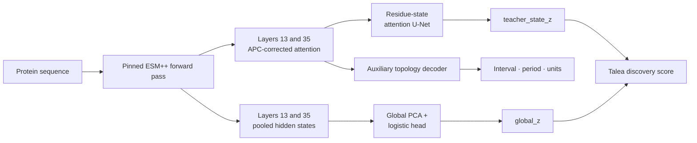

<p align="center">
  
</p>

# Talea

[](https://github.com/jwestrob/Talea/actions/workflows/tests.yml)


**Sequence-only discovery of elongated protein-solenoid architecture from
protein-language-model attention.**

Talea ranks proteins for solenoid-like structural repetition directly from
amino-acid sequence. It requires no experimental structure, predicted
structure, multiple-sequence alignment, or database search at inference time.
Alongside its primary protein-level score, Talea reports candidate repeat
intervals, periods, and registered units from the same model pass.

The name *talea* refers to the repeating rhythmic pattern in medieval
isorhythm: a recurring temporal unit that may persist beneath a changing
melodic surface. That is a pleasingly close analogy for divergent protein
sequences preserving an underlying repeated geometry.

## At a glance

| | |
|---|---|
| **Input** | Protein FASTA |
| **Primary output** | Continuous score for elongated/open solenoid-like architecture |
| **Localization output** | Candidate interval, period, and registered repeat units |
| **Structure required at inference** | No |
| **Alignment required** | No |
| **Maximum frozen length** | 2,046 aa |
| **Accepted residues** | The 20 canonical amino acids only |
| **Current status** | Research software; ranking model, not a curated annotation caller |

> [!NOTE]
> Talea deliberately has no hard positive/negative threshold. Its primary
> output is a ranking score for discovery and follow-up, not a definitive
> structural or biological annotation.

## Why Talea?

Protein solenoids are built from repeated structural units, but the sequence
identity between units can be weak or effectively absent. Sequence-repeat
finders therefore miss many structurally repetitive proteins, while
structure-based tools first require an experimental model or a successful
structure prediction. The latter can be expensive at metagenomic scale and
can be unreliable for unusual, long, oligomeric, or context-dependent
proteins.

Protein-language-model attention offers another view. Repeated structural
relationships can produce periodic, translated patterns in attention space
even when conventional sequence alignment is uninformative. Talea reads both
that local geometry and the protein's global language-model representation.
It is intended as a fast triage layer: identify the sequences most worth
folding, inspecting, or testing with structure-aware methods.

“Sequence-only” describes inference. Structural annotations were used during
model development and evaluation.

## How Talea works



One ESM++ pass supplies both branches:

1. **Residue-state branch.** Attention from zero-based transformer layers 13
   and 35 is symmetrized, average-product corrected, rectified, and averaged
   across heads. A compact two-dimensional U-Net reads the two attention
   channels plus normalized sequence position in 128-residue tiles.
   Predictions are reconstructed from each tile's central 64-residue diagonal.
   The mean elongated-state probability is logit-transformed and standardized
   against frozen development controls.
2. **Global branch.** Residue-wise means and population standard deviations of
   hidden states from the same two layers are passed through a frozen
   standardization, whitened 64-component PCA, and balanced logistic head.
   Its probability is likewise logit-transformed and standardized against
   frozen controls.
3. **Auxiliary topology branch.** Multi-scale attention spectra propose repeat
   periods and intervals. Talea then registers translated units and evaluates
   terminal closure and plausible boundaries. These outputs support
   localization and interpretation but do not enter the primary v2 rank.

The frozen primary score is the unweighted mean of the two independently
standardized protein views:

```text
Talea_discovery = 0.5 × teacher_state_z + 0.5 × global_z
```

No coefficient in this fusion was fit to the evaluation cohort.

### Why layers 13 and 35?

Layer indices are zero-based transformer-block indices. All 36 ESM++ layers
were compared under the same attention-harmonic formulation on a canonical
development cohort of 127 positives and 126 length-matched controls:

- layer 13 had the highest development AUROC: 0.663, with AP 0.658;
- layer 35 had the highest development AP: 0.688, with AUROC 0.651.

The pair therefore preserves the best layer under each pre-existing metric
without a combinatorial layer-pair search. The choice was made before the
452-protein comparator cohort existed and remained fixed thereafter. Blindly
averaging the final eight layers performed substantially worse on the
homology-disjoint confirmation cohort.

## Installation

### Requirements

- Python 3.10 or newer
- PyTorch
- Transformers 4.57 or newer
- CUDA or Apple MPS strongly recommended

Clone and install in an isolated environment:

```bash
git clone https://github.com/jwestrob/Talea.git
cd Talea

python -m venv .venv
source .venv/bin/activate
python -m pip install --upgrade pip
python -m pip install -e .
```

The small Talea heads and calibrations are included in the package. The pinned
`Synthyra/ESMplusplus_large` checkpoint is not vendored. Its primary weight
file is approximately 2.3 GB and is downloaded into the normal Hugging Face
cache on first use.

Talea pins the ESM++ repository revision in its deployment contract. Loading
that model currently requires `--trust-remote-code`. After the exact revision
has been cached, `--local-files-only` prevents further network access.

## Command-line use

### Apple Silicon

```bash
talea \
  --input proteins.faa \
  --output predictions.jsonl \
  --device mps \
  --trust-remote-code
```

### CUDA

```bash
talea \
  --input proteins.faa \
  --output predictions.jsonl \
  --device cuda \
  --trust-remote-code
```

### Automatic device selection

```bash
talea \
  -i proteins.faa \
  -o predictions.jsonl \
  --device auto \
  --trust-remote-code
```

`auto` selects CUDA, then MPS, then CPU. CPU inference is supported but is
generally impractical for large screens.

Talea writes:

- one JSON object per protein to the requested JSONL file; and
- a sibling `<output>.audit.json` containing exact input, output, model,
  environment, and artifact checksums.

### CLI options

| Option | Meaning | Default |
|---|---|---:|
| `-i`, `--input` | Protein FASTA | required |
| `-o`, `--output` | Prediction JSONL | required |
| `--device` | `auto`, `cpu`, `mps`, `cuda`, or an explicit Torch device | `auto` |
| `--dtype` | `auto`, `fp16`, `fp32`, or `bf16` | `auto` |
| `--maximum-batch` | Maximum proteins per padded ESM++ batch | 64 |
| `--square-budget` | Upper bound on batch size × padded sequence length² | 4,000,000 |
| `--postprocess-workers` | CPU threads for topology decoding | up to 4 |
| `--trust-remote-code` | Permit the pinned ESM++ model implementation to load | off |
| `--local-files-only` | Use only the local Hugging Face cache | off |
| `--overwrite` | Replace an existing output and audit | off |
| `--quiet` | Suppress progress messages | off |
| `--version` | Print Talea's version | — |

Run `talea --help` for the live interface.

## Python API

```python
from talea.artifacts import load_deployment
from talea.inference import TaleaPredictor
from talea.io import read_fasta

deployment = load_deployment()
records = read_fasta(
    "proteins.faa",
    maximum_length=deployment["input_contract"]["maximum_residues"],
)

predictor = TaleaPredictor(
    device="cuda",
    dtype="fp16",
    trust_remote_code=True,
)

for prediction in predictor.iter_predictions(records, progress=True):
    print(
        prediction["record_id"],
        prediction["talea_discovery_score"],
        prediction["wedge_call"],
    )
```

Load one `TaleaPredictor` and reuse it. Starting multiple processes on the same
GPU duplicates ESM++ and its attention buffers.

## Input contract

Talea validates the complete FASTA before loading ESM++.

- Only `ACDEFGHIKLMNPQRSTVWY` is accepted.
- A single terminal `*` is removed as a FASTA serialization marker.
- Internal stops, repeated terminal stops, ambiguity codes, and all other
  noncanonical characters are errors.
- Residues are never masked, imputed, or replaced.
- FASTA record identifiers—the first whitespace-delimited header token—must be
  unique.
- Empty sequences are errors.
- The frozen v2 maximum is 2,046 residues.
- Sequences longer than the evaluation maximum of 1,732 residues are accepted
  through 2,046 aa but explicitly marked as length extrapolations.

If any record violates the contract, the run stops before model inference.

Predictions are emitted in length-sorted order to reduce padded-attention
memory. Join outputs back to inputs by `record_id`, not line number.

## Output interpretation

All residue coordinates are zero-based and half-open: `start` is included and
`end` is excluded.

| Field | Interpretation |
|---|---|
| `record_id` | FASTA identifier |
| `sequence_sha256` | SHA256 of the exact normalized amino-acid sequence |
| `talea_discovery_score` | Primary stable v2 ranking score |
| `primary_score_field` | Explicit declaration of the field to rank |
| `teacher_state_probability` | Mean predicted elongated-state probability |
| `teacher_state_z` | Control-standardized logit of the state probability |
| `global_probability` | Frozen global-head probability |
| `global_z` | Control-standardized logit of the global probability |
| `topology_development_control_z` | Auxiliary attention-topology score |
| `status` | `ok` when a wedge was localized; otherwise `no_wedge_call` |
| `candidate_periods` | Period hypotheses in residues, including plausible aliases |
| `wedge_call` | Highest-scoring candidate interval, period, and wedge score |
| `registration.units` | Proposed repeat-unit boundaries around the wedge |
| `closure` | Terminal-to-adjacent attention summary for registered units |
| `boundary_scan` | Alternative plausible boundary-pair diagnostics |
| `frozen_spectrum` | Layer-specific harmonic attention summaries |
| `length_scope` | Evaluation-length boundary and extrapolation flag |
| `evidence_status` | Explicitly marks the result as an unverified model output |

Two additional fields deserve care:

- `talea_teacher_score` is retained for historical schema compatibility. It
  is not the primary v2 ranking field.
- `predicted_teacher_mean_class_probability` contains auxiliary soft model
  outputs inherited from the structural teacher. These are diagnostic model
  probabilities, not curated structural class assignments.

To make a simple ranked TSV:

```bash
jq -r \
  '[.record_id, .length, .talea_discovery_score, .teacher_state_z, .global_z,
    (.wedge_call.start // ""), (.wedge_call.end // ""),
    (.wedge_call.period // "")] | @tsv' \
  predictions.jsonl |
sort -t $'\t' -k3,3gr > ranked_talea.tsv
```

## Scaling and hardware

Transformer attention is quadratic in sequence length. Talea therefore
length-sorts inputs and constrains batches by
`batch_size × padded_length²`, rather than by record count alone.

- Lower `--square-budget` if a GPU runs out of memory.
- Lower `--maximum-batch` when screening many short proteins.
- `--postprocess-workers` controls CPU-only topology work and does not load
  additional ESM++ copies.
- Attention matrices, residue embeddings, and residue-state tracks are reduced
  in memory and are not retained on disk.
- For reproducibility and memory efficiency, run one Talea process per GPU.

The 2,046-aa ceiling is part of the frozen deployment contract, not a
fundamental limit of the method. Longer proteins currently require an
explicitly designed and validated windowing strategy; Talea does not silently
tile or truncate them.

## Benchmark

The principal comparator cohort contains 452 canonical proteins: 226
elongated/open-repeat positives and 226 reviewed hard controls. It contains
one representative per sensitive homology group, and resampling is performed
over those groups rather than treating related sequences as independent.

SOLeNNoID received chain-specific experimental coordinates. Talea received
amino-acid sequence only.

| Evaluation | Talea AP | Talea AUROC | Talea normalized pAUROC at FPR 0.1 |
|---|---:|---:|---:|
| Original sealed Talea score | 0.991 | 0.988 | 0.953 |
| Stable discovery v2 | 0.99598 | 0.99454 | 0.97564 |

The fixed SOLeNNoID mean-total comparator reached AP 0.98371, AUROC 0.98308,
and normalized pAUROC 0.89623.

For the **original sealed Talea score**, Talea minus SOLeNNoID was +0.007 AP
with a 95% homology-group paired interval of [-0.003, +0.019], and +0.005
AUROC with an interval of [-0.007, +0.017]. Talea had the higher point
estimates, but the predeclared conclusive-win rule required the lower AP bound
to exceed zero and therefore failed.

For **stable discovery v2**, 20,000 label-stratified homology-group paired
bootstrap replicates gave Talea-minus-SOLeNNoID intervals entirely above zero:

- AP: [+0.00317, +0.02426]
- AUROC: [+0.00182, +0.02283]
- normalized pAUROC: [+0.02561, +0.15189]

### What “post-opening” means here

> [!IMPORTANT]
> The 452-protein cohort was genuinely sealed and score-blind for the original
> Talea evaluation. Stable discovery v2 was formulated only after that cohort
> had been opened. The underlying state and global models, their calibrations,
> and the selected ESM++ layers remained frozen, and the v2 fusion is a
> transparent 50:50 mean rather than a coefficient fit to these labels.
> Nevertheless, the formulation decision occurred with the cohort's results
> available. The v2 comparison is therefore post-opening secondary evidence,
> not an independent held-out estimate.

In practical terms:

- The **original sealed result** is the confirmatory benchmark result.
- The **stable v2 result** shows that the released formulation performs very
  strongly on this known cohort and supports its use for discovery.
- The v2 result should not be described as an independently confirmed win.
- Confirming v2 requires a genuinely new cohort whose labels and comparator
  scores remain unseen until the v2 score is frozen.

This distinction is statistical, not semantic: unchanged components and
non-fitted equal weights reduce the opportunity for overfitting, but they do
not make an opened evaluation set new again.

## Limitations

- Talea ranks candidates; it does not make curated structural or biological
  calls.
- No universal score threshold has been calibrated for arbitrary sequence
  collections. Score distributions can shift with proteome composition.
- The current comparator contains 226 positives and 226 hard controls, one per
  sensitive homology group. A new independent cohort is still needed to
  confirm stable v2 because this cohort had already been opened when v2 was
  formulated.
- Candidate periods can have harmonic or subharmonic aliases. Treat the
  reported period and unit registration as hypotheses for inspection.
- The 1,733–2,046-aa range is a declared length extrapolation, and proteins
  above 2,046 aa are not accepted.
- Runtime and memory scale quadratically with sequence length.
- “Sequence-only” applies to inference; the residue-state head was developed
  with structural supervision.
- A high score is evidence for the architecture Talea learned, not proof of
  monomeric state, oligomeric context, membrane association, or biological
  function.

## Reproducibility

The released tool is intentionally inference-only. It contains:

- runtime source under `talea/`;
- a frozen 132-KB attention head;
- a frozen 2.4-MB global head;
- calibration and deployment contracts;
- checksum verification for every bundled artifact;
- focused unit and integration tests; and
- a toy FASTA smoke input.

It does **not** contain training pipelines, source datasets, attention-matrix
caches, comparator installations, or generated benchmark result trees.

Key frozen provenance:

| Artifact | SHA256 |
|---|---|
| Deployment contract | `7aa5b7f320323b34d2db27b0df488732d1fcec39d72e2d0f5b774ebec1edea2e` |
| Residue-state teacher head | `130840931f4f8be768f2789cbe8a5db8bc2611fd5605fc797f1023156d4c625e` |
| Global head | `8701dad34e3392a0f84884e88d0bf3e9741a75903882ec7658bbb8b2fb2161de` |
| Pinned ESM++ revision | `f813401638b3fddab09748aec1ad2bf537aa4208` |
| External ESM++ weight file | `4aff3f8c5de68c4d3e3824eb2c478e4a47355d3f849f3c745e5c8a5ee6cff851` |

The complete bundled manifest is
[`talea/assets/SHA256SUMS`](talea/assets/SHA256SUMS), and the machine-readable
deployment contract is
[`talea/assets/deployment.json`](talea/assets/deployment.json).

The standalone refactor was checked against the original production runner on
a fresh ESM++ pass. The primary score, both component scores, auxiliary
topology score, candidate periods, wedge interval, and registered units were
identical.

Run the test suite:

```bash
python -m pip install -e '.[test]'
pytest
```

## Name and historical identifiers

Talea was originally developed under the name Pangu. Historical
machine-readable keys such as `frozen_pangu_development_control_z` remain in
some auxiliary output and contracts where renaming them would break artifact
provenance. New public interfaces use the Talea name.

## Citation

A Talea methods manuscript is in preparation. Until a DOI is available,
please cite the repository URL together with the version or Git commit used,
and retain the generated audit file for exact model provenance.

## Contributing

Issues and focused pull requests are welcome. Changes to model arithmetic,
layers, calibrations, or bundled artifacts should be treated as a new model
version and evaluated on a cohort not used to choose the change.
